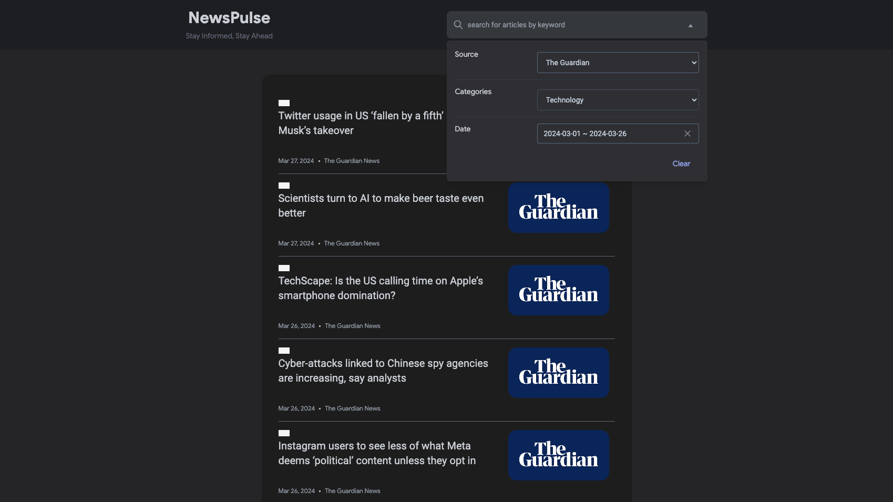

# NewsPulse

This is a simple React application that demonstrates news aggregator website that pulls articles from News Api, New York Times and The Guardian.



## Prerequisites

- Docker installed on your machine. If you don't have Docker installed, you can download it from [Docker's official website](https://www.docker.com/products/docker-desktop).
- Node.js installed on your machine. If you don't have Node.js installed, you can download it from [Node.js's official website](https://nodejs.org/).

## Installation

<details open>
  <summary>With Docker</summary>

  <p>&nbsp;</p>

1. **Clone the repository:**

   ```bash
   git clone https://github.com/frantanius/news.git
   ```

   ```bash
   cd news
   ```

2. **Build and run the app with Docker:**
`bash
    docker-compose up --build
    `
</details>

<details>
  <summary>Without Docker</summary>
  <p>&nbsp;</p>

1. **Clone the repository:**

   ```bash
   git clone https://github.com/frantanius/news.git
   ```

   ```bash
   cd news
   ```

2. **Install the app:**

- Choose one of the following package managers to install the app:

- _using pnpm:_
  ```
  pnpm i
  ```
- _using yarn:_
  ```
  yarn install
  ```
- _using npm:_
  ```
  npm run install
  ```

3. **Run the app:**

- _using pnpm:_
  ```
  pnpm start
  ```
- _using yarn:_
  ```
  yarn start
  ```
- _using npm:_
  ```
  npm run start
  ```

4. **Build the app _(optional)_:**

- _using pnpm:_
  ```
  pnpm build
  ```
- _using yarn:_
  ```
  yarn build
  ```
- _using npm:_
`     npm run build
    `
</details>

## Accessing the App

After running the app with Docker or without Docker, you can access it by opening your web browser and navigating to `http://localhost:3000`.

## Demo

[website](https://news-seven-murex.vercel.app/)
